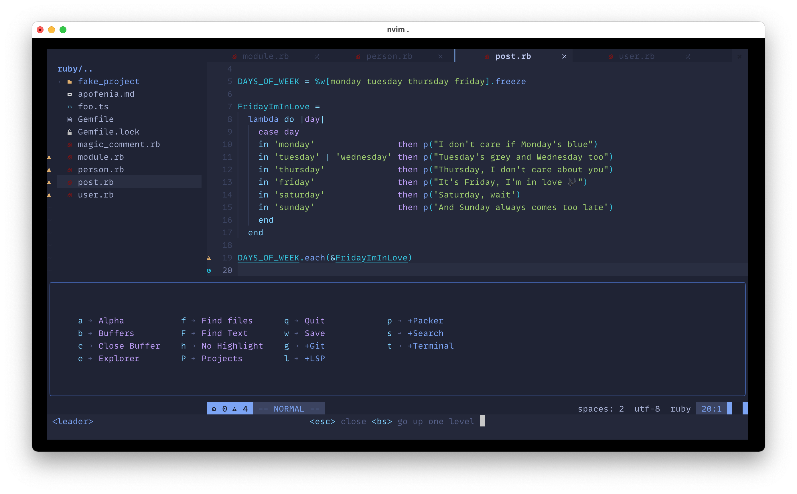

# My Dotfiles



## Instalation

Copy this directory to `~/.config` and open neovim.

## Get healthy

Open `nvim` and enter the following:

```
:checkhealth
```

You'll probably notice you don't have support for copy/paste also that python and node haven't been setup

So let's fix that

First we'll fix copy/paste

- On mac `pbcopy` should be builtin

- On Arch Linux

  ```
  sudo pacman -S xsel
  ```
Next we need to install python support (node is optional)

- Neovim python support

  ```
  pip install pynvim
  ```

- Neovim node support

  ```
  npm i -g neovim
  ```
---

### Neovim version

    NVIM v0.9.0
    Build type: Release
    LuaJIT 2.1.0-beta3

Aristóteles Dotfiles
