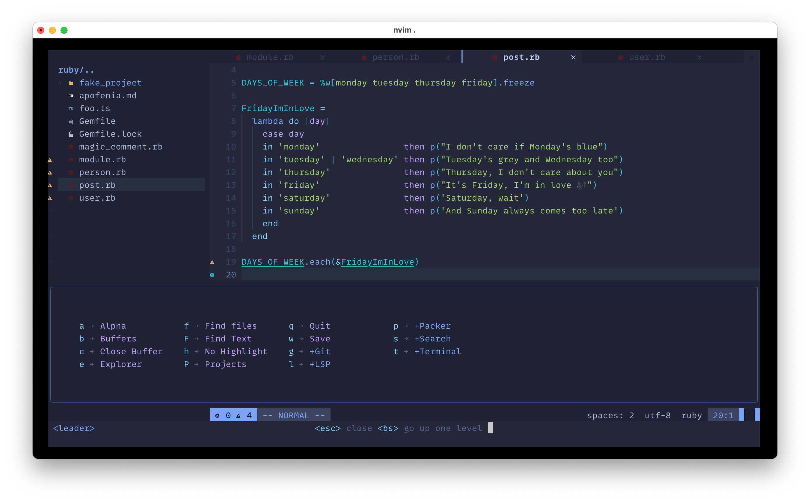

# Dotfiles



## Install

Numa máquina nova, do zero:

```sh
git clone https://github.com/aristotelesbr/dotfiles.git ~/.dotfiles
cd ~/.dotfiles
./install.sh --dry-run   # veja o que vai acontecer
./install.sh             # aplique
```

Com a chave SSH já configurada, troque a URL por
`git@github.com:aristotelesbr/dotfiles.git`.

O clone precisa ficar num lugar definitivo: a instalação cria symlinks
apontando pra ele, então mover ou apagar o diretório quebra o shell e o nvim.
`~/.dotfiles` é uma escolha segura — se um dia mudar de lugar, é só rodar o
`install.sh` de novo a partir do caminho novo.

O script linka cada diretório no lugar que a ferramenta espera, guarda a
configuração anterior em `~/.dotfiles-old/` com sufixo `-old` (ex.: `nvim-old`)
e remove os artefatos regeneráveis das configs antigas (plugins do lazy.nvim,
mason, TPM, caches) depois de confirmar. `./install.sh --help` lista as flags
(`--copy`, `--no-clean`, `--no-fonts`, `--yes`, `--config-home`).

| Repo | Destino |
| --- | --- |
| `nvim/` | `~/.config/nvim` |
| `tmux-config/tmux/` | `~/.config/tmux` |
| `zsh/` | `~/.config/zsh` |
| `zsh/zshrc` | `~/.zshrc` |
| `terminal/starship.toml` | `~/.config/starship.toml` |
| `install/fonts/` | `~/Library/Fonts` |

O perfil do iTerm2 (`terminal/tokyo-compact-profile.json`) é importado à mão:
Settings → Profiles → Other Actions ▾ → Import JSON Profiles...

Depois de instalar, abra o `nvim` e rode `:checkhealth` — provavelmente vai
precisar de `pip install pynvim` (suporte a Python) e `npm i -g neovim`
(suporte a Node, opcional).
